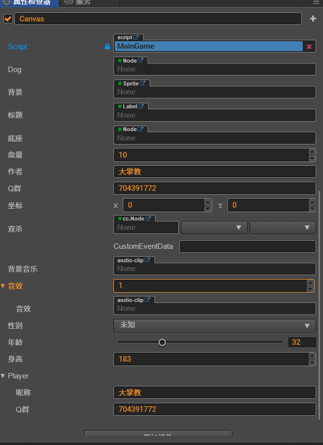

# TS版属性定义
涵盖了常用的TS属性定义方法，让代码写的更简洁优雅
- 简单节点属性
- 给属性增加中文显示名称
- 增加说明提示文字
- 整数输入，限制取值范围
- 自定义中文内容下拉框
- 文本框
- 滑动条
- 事件回调
- 音频剪辑
- 节点数组
- 互斥面板
- 自定义属性

完整的面板：

详细教程可以看博客地址：https://darkpalm.blog.csdn.net/article/details/90960011

微信公众号ID：darkpalm

扫码关注微信公众号，可以获取更多技术文档，官网都没有的文档哦。

